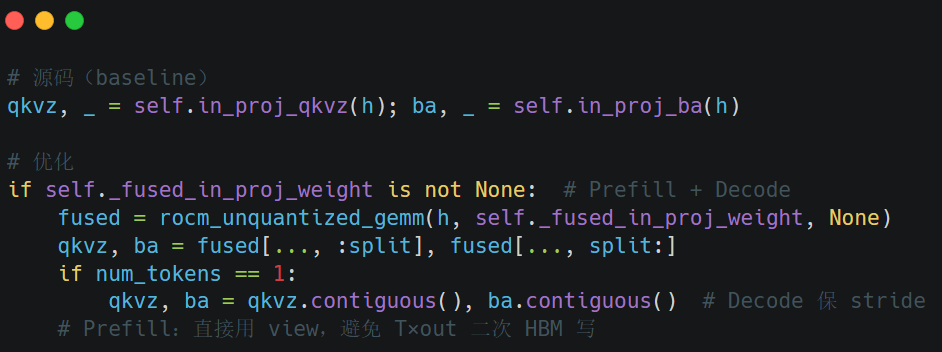

# 山西大学登崇队\(T2026101089911233\)26先导杯基于国产加速卡的千问大模型推理服务优化说明文档

# 最终结果展示

## 容器展示结果

## 评测机展示结果

# profile

## baseline:

# 具体优化过程

## 一、DCU 瘦 GEMV（LLMM1）与 Prefill 瓦片校准

#### 1\.1 Decode 瘦 GEMV（LLMM1，K≤8192）

**原理与改法**

Decode 阶段 Linear 为 M=1 memory\-bound：墙钟受权重 HBM 读主导，而非算力。源码 Skinny 仅覆盖 MI（gfx90a/942/950），DCU 走通用 F\.linear/易误入 hipBLASLt，TPOT 上不去。优化在 HIP 侧打开 gfx936 编译，并在 Python 侧做 LLMM1\-only 路由：仅 n==1、k≤8192、无 bias 时调用 \_rocm\_C 的 LLMM1（128bit 合并访存）；k\>8192 硬封顶回退通用路径，避免数值漂移。配合 TORCH\_BLAS\_PREFER\_HIPBLASLT=0，保证 M=1 不走慢 BLAS 后端。

**代码对比**

**路径**：csrc/rocm/skinny\_gemms\.cu，csrc/rocm/attention\.cu，vllm/platforms/rocm\.py，vllm/model\_executor/layers/utils\.py

#### 1\.2 Prefill 瓦片上限（BLOCK=32）

**原理与改法**
gfx936 上报 capability 9\.x，源码 has\_device\_capability\(80\) 会选 BLOCK=128。对 Qwen head\_dim=256，Q/K/V 片上工作集近似随 BLOCK×hd 膨胀，易超 Triton/HIP shared 硬顶（日志常见 64KB 级失败）或严重 thrash，TTFT 全面恶化。优化在 ROCm 且 hd≥256 时强制 BLOCK=32：牺牲部分单次算子占用换可运行性与稳定 Prefill 时延，属于 Shared\-Memory / LDS 预算约束下的 tile sizing，不改 softmax 数学。

**代码对比**

**路径**：vllm/v1/attention/ops/triton\_prefill\_attention\.py

#### 1\.3 Flash\-Decoding 并行 Softmax 分段：段数 16→32

**原理与改法**
B≈1 长 Decode 分段不足、CU 填充差。优化：分段×2，online\-softmax 数学等价。

**代码对比**

**路径**：vllm/v1/attention/backends/triton\_attn\.py

#### 1\.4 KV 访存提示（evict\_last）

**原理与改法**
长序列扫 KV 易冲刷 cache。优化：K/V tl\.load 加 evict\_last，不改 TILE/stages。

**代码对比**

**路径**：vllm/v1/attention/ops/triton\_unified\_attention\.py

**优化效果**

## 二、长上下文 Prefill/Decode 调优：自适应 Flash\-Decoding 与非对称 Prefill 瓦片

#### 2\.1 序列自适应 Flash\-Decoding 分段

**原理与改法**
优化：Flash\-Decoding 上限 32，eager 按 seq 自适应段数；CUDA Graph 捕获时固定 grid Z

**代码对比**

**路径**：vllm/v1/attention/backends/triton\_attn\.py

#### 2\.2 非对称 Prefill 瓦片与软件流水

**原理与改法**

长上下文 Prefill 的 Full Attention 对已缓存 KV 做扫描，墙钟由 HBM 延迟 \+ kernel launch 共同主导，而非单纯 FLOPs。源码易因 capability 误判选用过大对称瓦片，使 Triton shared memory / LDS 压力过高，TTFT 恶化。

优化采用 非对称分块（Asymmetric Tiling）：max\_input\_len≥8192 时取 **\(BLOCK\_M, BLOCK\_N\)=\(32,16\)**，即 Q 向保持并行度、KV 向缩小单次装载；同时 **num\_stages=3** 做 software pipelining，用多缓冲掩盖 HBM 往返。Unified Attention Prefill 侧配套** TILE=16**，避免 TILE 与 stages 同时放大触发 shared OOM。该几何只改 launch/分块，online\-softmax 数学不变，主收益落在 8K–32K Prefill TTFT。

**代码对比**

**路径**：triton\_prefill\_attention\.py，triton\_unified\_attention\.py，triton\_reshape\_and\_cache\_flash\.py（均在 vllm/v1/attention/ops/）

**优化效果：**

## 三、GDN/FLA 定参与 BLOCK\_M 二次幂修复

#### 3\.1 BLOCK\_M 二次幂对齐

**原理与改法**
Triton 要求 tl\.arange\(0, BLOCK\_M\) 的范围为 2 次幂。优化：ROCm Prefill 将 BLOCK\_M 提升并规范为 next\_power\_of\_2\(max\(Bm,32\)\)，**Qwen GQA=6 得 Bm=32、BQ=5。**

**代码对比**

**路径**：vllm/v1/attention/ops/triton\_unified\_attention\.py

#### 3\.2 FLA Chunk 定参（BKV=64，BT=64）

**原理与改法**
源码 autotune 空间过大易选 LDS 重配置。优化：ROCm 钉 BKV=\[64\]、收窄 warps/stages，BT=64。

**代码对比**

**路径**：fla/ops/chunk\_delta\_h\.py，chunk\_o\.py，utils\.py，mamba/ops/causal\_conv1d\.py，v1/attention/backends/utils\.py

**优化效果：**

## 四、大瓦片 Prefill FA 与 Decode GDN 融合

#### 4\.1  Prefill 大瓦片 FA（M=128，N=32）

**原理与改法**

在赛题锁定 max\-num\-batched\-tokens=4096 时，16K–32K 输入必须 chunked Prefill：每一 chunk 上 FA 层仍需扫描前缀 KV，launch 次数与 KV 内层循环次数随长度近似线性累积，TTFT 强烈稀释 Output 吞吐。

针对 Qwen3\.5 固定形状（head\_dim=256，GQA=24/4=6）启用形状特化路径：

1. **BLOCK\_M=128**：增大 Q 向分块 → 减少 program 数与 launch 税；

2. **TILE\_N=32**：增大 KV 瓦片 → 减少 ⌈L\_k / TILE\_N⌉ 内层循环；

3. **num\_stages=1** 强制：大 M×N×hd 工作集下禁止再开深流水，防止 LDS/VGPR 超限。

门控 q\>1 \&\& k≥4096 保证只打长 Prefill，Decode（q=1）仍走小 TILE，避免 TPOT 被误伤

**代码对比**

**路径**：vllm/v1/attention/ops/triton\_unified\_attention\.py

#### 4\.2  GDN Decode 值维瓦片（BV=128）

**原理与改法**

GDN（Gated Delta Rule）Decode 为固定维状态递推，计算量相对 FA 更轻，但仍受 重复加载 q/k/gating 与多 program launch 影响。源码对 V=128 取 BV=min\(next\_pow2\(V\),32\)=32，则 NV=⌈V/BV⌉=4：每个 value\-head 拆成 4 个 program，状态相关向量被重复从 HBM 读入。

优化对 Qwen3\.5 形状（**HV=48, V=K=128**）将 **BV 扩至 128、num\_warps=4**：单 program 覆盖整段 V，消除 4\-way 重载，提高 wavefront 占用以掩盖 HBM。递推公式不变，属 tile/occupancy 级优化，服务 Decode TPOT 与 Peak Output，与 4\.1 的 Prefill 大瓦片形成 Prefill/Decode 分工。

**代码对比**

**路径**：vllm/model\_executor/layers/fla/ops/fused\_recurrent\.py

#### 4\.3  Decode in\_proj 融合与 hipBLASLt 旁路

**原理与改法**
源码两次 Linear。优化：权重行维拼接后 Decode 一次 GEMV；强制 HIPBLASLT=0 保 TPOT。

**原理与改法**
源码 BV≤32 使 V=128 拆成 4 program/head、重复加载。优化：整 V 一瓦片 \+ warps=4，降 HBM/launch。

**代码对比**

**路径**：models/qwen3\_5\.py，qwen3\_next\.py，layers/utils\.py，vllm/env\_override\.py

**优化效果：**

## 五、FA TILE\_N 扩维与跨阶段 in\_proj 融合

#### 5\.1 Prefill FA TILE\_N（32→64）

**原理与改法**
在 M=128 大瓦片上仅加倍 KV tile，循环约减半；禁 stages≥2。

**代码对比**

**路径**：triton\_unified\_attention\.py，env\_override\.py

#### 5\.2 Prefill/Decode 融合 in\_proj

**原理与改法**

混合层中约 3/4 为 GDN，每层原有 in\_proj\_qkvz 与 in\_proj\_ba 两次 Linear。load\_weights 后将两套权在输出维拼接为 \_fused\_in\_proj\_weight（不改数值、不落盘），数学上
Y=X\[Wqkvz;Wba\]*Y*=*X*\[*Wqkvz*;*Wba*\] 与分乘再拼等价。

把融合从 Decode\-only（GEMV）扩展到 Prefill（大 M 的 GEMM）：每个 GDN 层、每个 chunk 少一次权重 HBM 遍历与一次 kernel launch。Prefill 切分后对 view 不强制 \.contiguous\(\)，避免对 T×out 大张量二次写回；Decode 仍 contiguous\(\) 以稳下游 stride。该点与 5\.1 的 TILE\_N=64 叠加，共同压 TTFT，且不改模型结构/tokenizer。

**代码对比**

**路径**：vllm/model\_executor/models/qwen3\_next\.py，qwen3\_5\.py

#### 5\.3 融合 Chunk 预处理

**原理与改法**
**cumsum⊕KKT⊕tril⊕WU **融核入库；VLLM\_ROCM\_GDN\_FUSED\_PREPROC 默认 0。

**代码对比**

**路径**：fla/ops/fused\_chunk\_preprocessing\.py，chunk\.py，env\_override\.py

**优化效果：**

# 优化点汇总表和效果总图

|优化点|代码路径 csrc/rocm/skinny\_gemms\.cu --- csrc/rocm/attention\.cu --- vllm/platforms/rocm\.py --- vllm/model\_executor/layers/utils\.py |Outout Token Throughput指标|P99 TTFT\(ms\)指标|P99 TPOT\(ms\)指标|
|---|---|---|---|---|
|一、DCU 瘦 GEMV（LLMM1）与 Prefill 瓦片校准||4K\-8K: baseline:12\.20 优化后:16\.20 --- 8\-16K: baseline:8\.81 优化后:9\.44 --- 16\-32K: baseline:4\.64 优化后:3\.64|4K\-8K: baseline:4789\.70 优化后:10454\.95 --- 8\-16K: baseline:25046\.71 优化后:15772\.61 --- 16\-32K: baseline:28744\.39 优化后:28823\.85|4K\-8K: baseline:69\.00 优化后:47\.01 --- 8\-16K: baseline:70\.48 优化后:47\.89 --- 16\-32K: baseline:71\.89 优化后:49\.43|
|二、长上下文 Prefill/Decode 调优：自适应 Flash\-Decoding 与非对称 Prefill 瓦片||4K\-8K: baseline:12\.20 优化后:16\.05 --- 8\-16K: baseline:8\.81 优化后:9\.61 --- 16\-32K: baseline:4\.64 优化后:4\.39|4K\-8K: baseline:4789\.70 优化后:12706\.21 --- 8\-16K: baseline:25046\.71 优化后:14022\.19 --- 16\-32K: baseline:28744\.39 优化后:25403\.34|4K\-8K: baseline:69\.00 优化后:46\.99 --- 8\-16K: baseline:70\.48 优化后:47\.89 --- 16\-32K: baseline:71\.89 优化后:48\.90|
|三、GDN/FLA 定参与 BLOCK\_M 二次幂修复||4K\-8K: baseline:12\.20 优化后:17\.25 --- 8\-16K: baseline:8\.81 优化后:12\.20 --- 16\-32K: baseline:4\.64 优化后:6\.99|4K\-8K: baseline:4789\.70 优化后:9053\.87 --- 8\-16K: baseline:25046\.71 优化后:7760\.80 --- 16\-32K: baseline:28744\.39 优化后:13168\.87|4K\-8K: baseline:69\.00 优化后:47\.53 --- 8\-16K: baseline:70\.48 优化后:49\.27 --- 16\-32K: baseline:71\.89 优化后:50\.55|
|四、大瓦片 Prefill FA 与 Decode GDN 融合 ||4K\-8K: baseline:12\.20 优化后:19\.12 --- 8\-16K: baseline:8\.81 优化后:14\.90 --- 16\-32K: baseline:4\.64 优化后:9\.73|4K\-8K: baseline:4789\.70 优化后:1933\.92 --- 8\-16K: baseline:25046\.71 优化后:4606\.87 --- 16\-32K: baseline:28744\.39 优化后:7707\.24|4K\-8K: baseline:69\.00 优化后:47\.09 --- 8\-16K: baseline:70\.48 优化后:48\.60 --- 16\-32K: baseline:71\.89 优化后:50\.18|
|五、FA TILE\_N 扩维与跨阶段 in\_proj 融合||4K\-8K: baseline:12\.20 优化后:19\.56 --- 8\-16K: baseline:8\.81 优化后:14\.92 --- 16\-32K: baseline:4\.64 优化后:12\.22|4K\-8K: baseline:4789\.70 优化后:1964\.41 --- 8\-16K: baseline:25046\.71 优化后:4477\.67 --- 16\-32K: baseline:28744\.39 优化后:6804\.29|4K\-8K: baseline:69\.00 优化后:45\.14 --- 8\-16K: baseline:70\.48 优化后:46\.13 --- 16\-32K: baseline:71\.89 优化后:47\.11|

